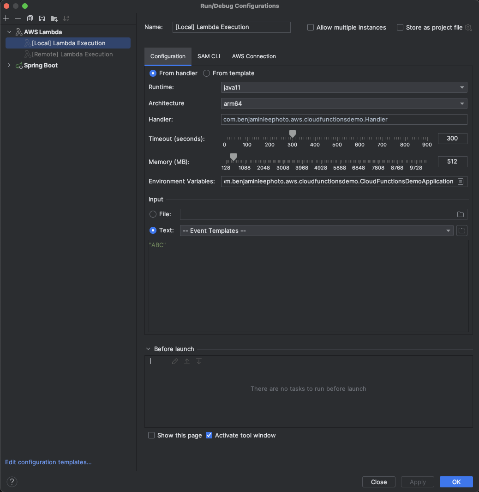
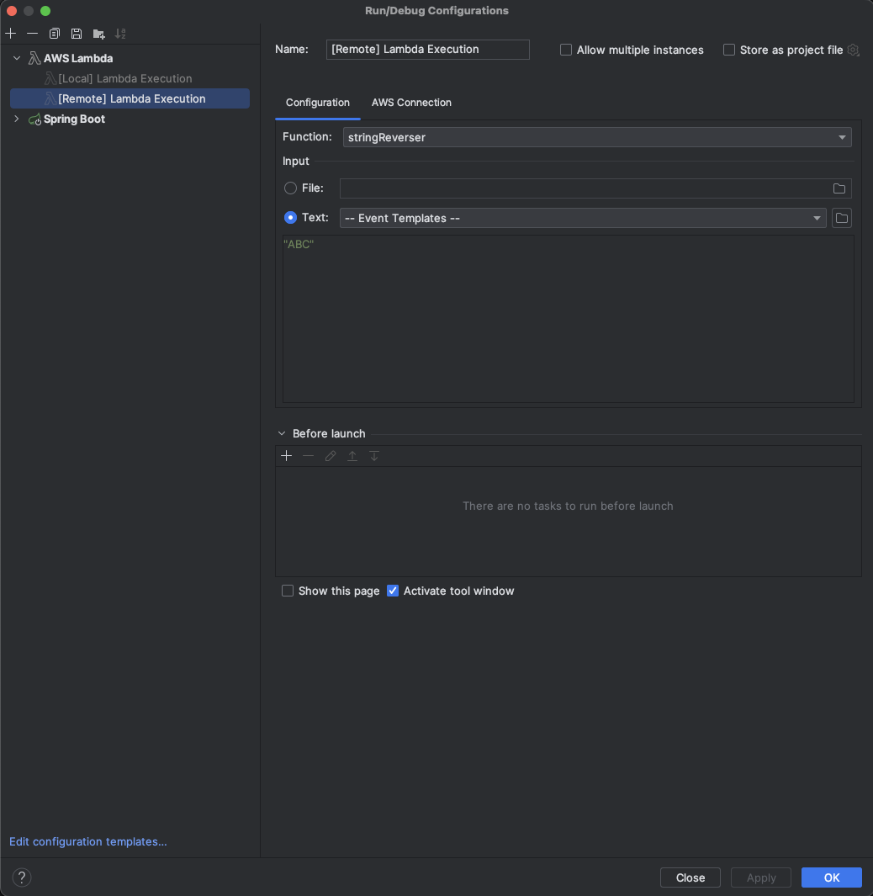
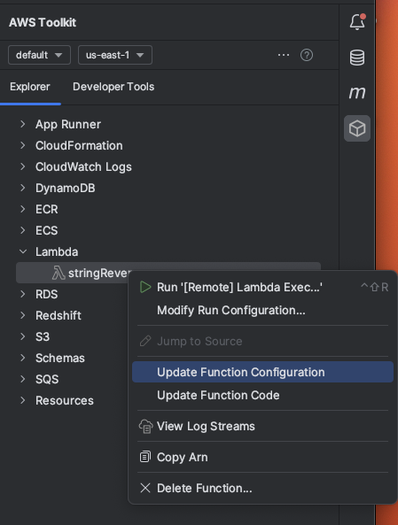
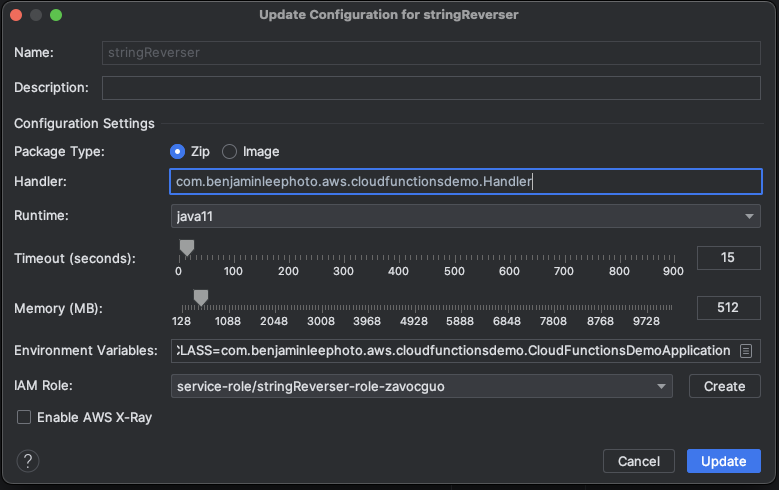
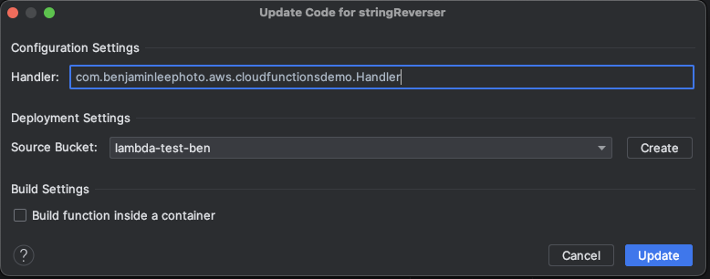

# Cloud Functions Demo

## Pre-requisites

In order to run lambdas locally and remotely please do the following first

1. Install the [AWS Toolkit plugin](https://docs.aws.amazon.com/toolkit-for-jetbrains/latest/userguide/setup-toolkit.html) for IntelliJ
2. Install Docker via Brew `brew install --cask docker`
3. Install AWS SAM via Brew `brew install aws-sam-cli`
4. In your IntelliJ settings under Tools > AWS set the SAM CLI executable to `/opt/homebrew/bin/sam`

## Run Configuration

### Local

To run locally setup a local lambda run configuration like so.

At the time of writing this the latest Java runtime for Lambda is Java 11 so select that.

For architecture select `arm64` if running on a Mac M1

For handler, we need a class within our project that extends Sprint's FunctionInvoker for some reason, I'm not sure why. When I try to reference FunctionInvoker directly in the config the IDE throws an error. Om this example we use `com.benjaminleephoto.aws.cloudfunctionsdemo.Handler` 

Set the main class environment variable to `MAIN_CLASS=com.benjaminleephoto.aws.cloudfunctionsdemo.CloudFunctionsDemoApplication`. If not set the following error is thrown:

 Failed to discover main class. An attempt was made to discover main class as 'MAIN_CLASS' environment variable, system property as well as entry in META-INF/MANIFEST.MF (in that order).

Be sure to add the text you would like to input to your lambda function in the "Text" field.

### Remote

To run remotely setup a lambda remote run configuration like so.

You will also need to open the AWS Toolkit window where you will see the Lambda (create if needed via console or IDE). Right-clicking on the lambda you will see two options. One to update the config and one to update the code.

For the function configuration make the following selections. You will notice options look similar to the local run configuration, commentary on the settings can be found documented above in that section.

Lastly the function code settings can be set as so, please create an S3 bucket with the create button which is where the plugin will stage  your lambda code. 

To run the lambda remotely simply right-click on the lambda in the AWS Toolkit window and select `Update Function Code`. Once the updated code has been published to AWS simply run the remote lambda run configuration in your IDE to execute the lambda on AWS.